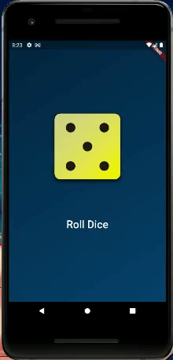

# Aplicativo de Rolagem de Dado

Pequeno projeto feito durante meus estudos de Flutter.

Foi desenvolvido especificamente, durante o curso do Maximilian Schwarzmüller, "Flutter & Dart - The Complete Guide", disponível na Udemy.

## Sobre o Aplicativo

O projeto consiste em imagens de cada lado de um dado, que são randomizadas quando o botão "roll dice" (rolar dado) é pressionado.

Para dar uma sensação melhor de que o dado realmente está rolando, foi utilizado animação.

## Informações Extras

- Este aplicativo foi testado apenas no Android
- As imagens do dado foram diponiblizadas através do curso "Flutter & Dart - The Complete Guide"
